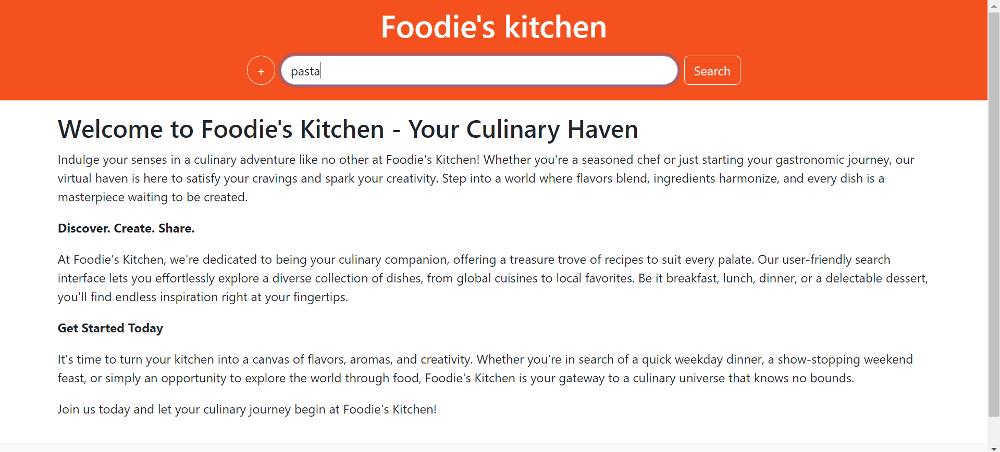
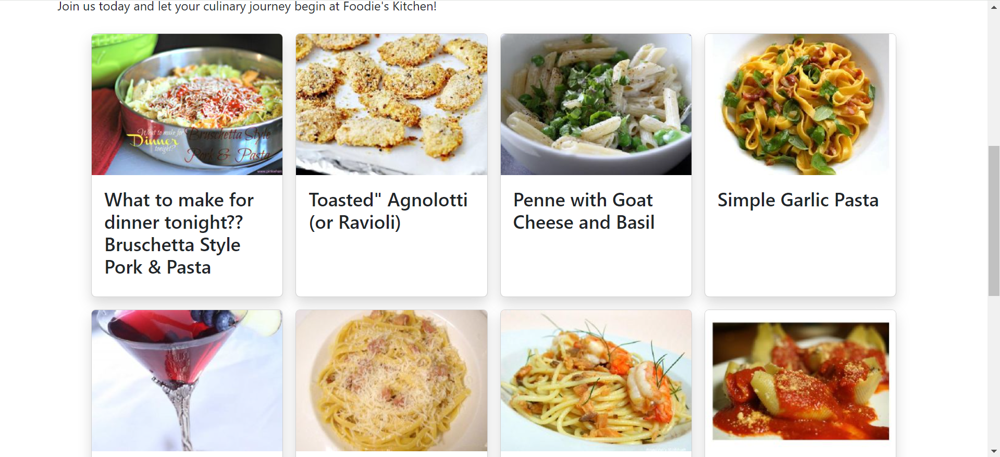

# Foodie's Kitchen

Welcome to Foodie's Kitchen, your go-to destination for discovering delicious recipes and culinary inspiration!

## Overview

Foodie's Kitchen is a web-based recipe platform designed to provide users with a diverse collection of recipes from around the world. With a simple and intuitive interface, Foodie's Kitchen allows you to explore, search, and discover new recipes based on your preferences.

## Features

- **Recipe Search:** Search for recipes based on keywords, ingredients, or cuisine types.
- **Explore Recipes:** Browse through a curated collection of recipes from various cuisines.
- **Ingredient Input:** Input ingredients to find recipes that match your available ingredients.
- **Save Favorites:** Save your favorite recipes for quick access later.
- **Share Recipes:** Share your favorite recipes with friends and family via social media.

## Getting Started

To get started with Foodie's Kitchen, simply visit [Foodie's Kitchen](https://singh-jas-meet.github.io/Recipe/) and start exploring! You can search for recipes, browse through different categories, and discover new culinary delights.

## Technologies Used

- HTML
- CSS (Bootstrap)
- JavaScript

## Screenshots

 

## API

Foodie's Kitchen utilizes the [Spoonacular API](https://spoonacular.com/food-api) to fetch recipe data. The Spoonacular API provides access to a vast database of recipes, ingredients, and nutrition information, allowing Foodie's Kitchen to offer a wide range of culinary options to its users.

## How to Use

### Adding Multiple Ingredients

1. **Typing Ingredients:** Type an ingredient in the search box and press Enter to add it to the list of ingredients.
2. **Clicking + Button:** Beside the search box, click the "+" button to add the typed ingredient to the search query.
3. **Repeat:** Repeat the process to add multiple ingredients to your search query.

## Developer

- **Jasmeet Singh**

## Acknowledgments

- Icons from [Icons8](https://icons8.com)
- Special thanks to [Spoonacular](https://spoonacular.com) for providing recipe data through their API.
